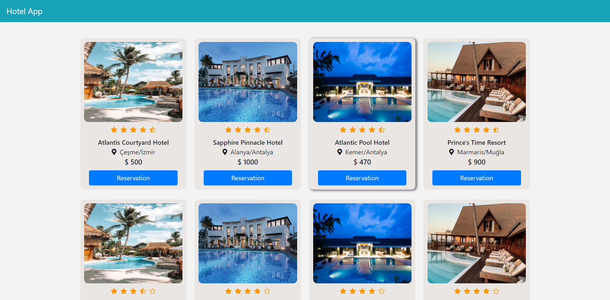
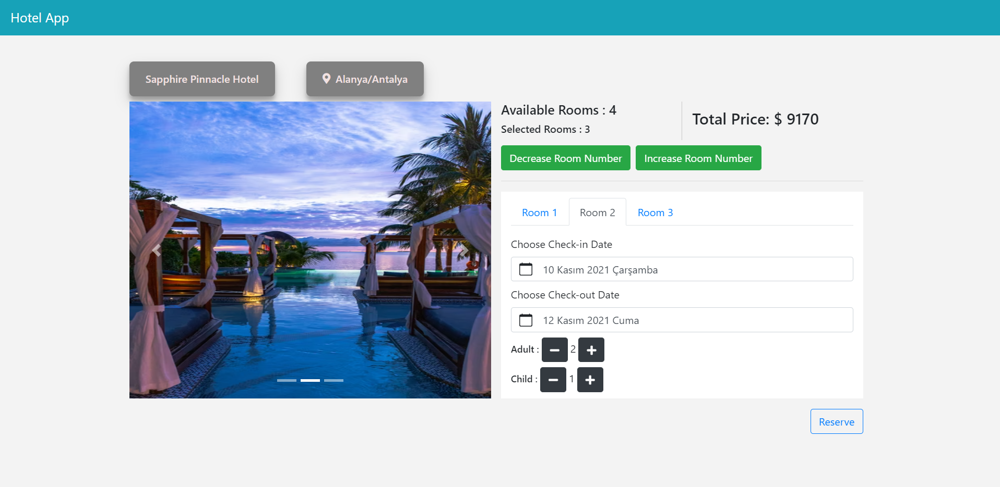

# 138 Reengen Full-Stack Bootcamp | Week-2 Homework

Shopping Application built in VueJs.

# [Live Demo](https://hotel-app-week-2-gokberk.netlify.app/)

## Hotel Reservation Application

### Content of Project

- Hotels are shown in a list with name, rating, location and price.



- By selecting the hotel card, the hotel pre-reservation page is reached.
- Client and room number, check-in/check-out dates can be determined. These parameters set the total price.



- Forms are listed in the room tabs for each client. 
- User reaches the payments page when all client's information forms are valid.


### Build With

- HTML
- CSS
- [BootstrapVue](https://bootstrap-vue.org/)
- [VueJs](https://vuejs.org/)
- [VueRouter](https://router.vuejs.org/)
- [Vuelidate](https://vuelidate.js.org/)


#### Project setup
```
npm install
```

##### Compiles and hot-reloads for development
```
npm run serve
```

##### Compiles and minifies for production
```
npm run build
```

##### Lints and fixes files
```
npm run lint
```

##### Customize configuration
See [Configuration Reference](https://cli.vuejs.org/config/).
